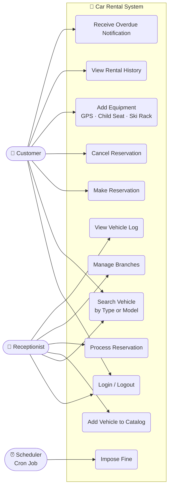
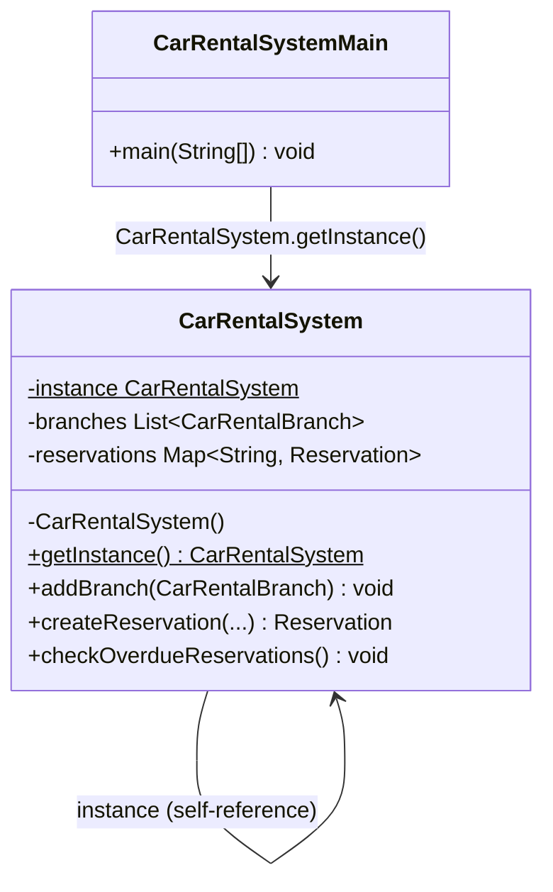
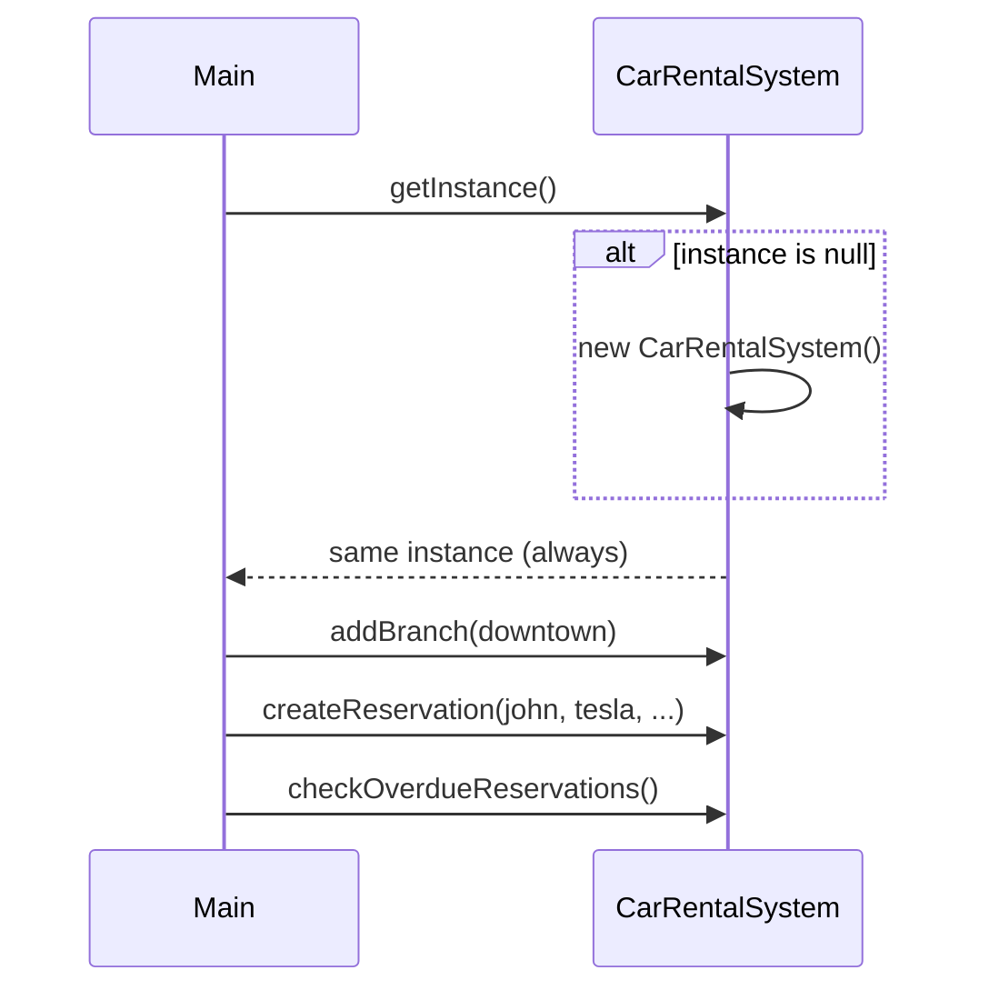
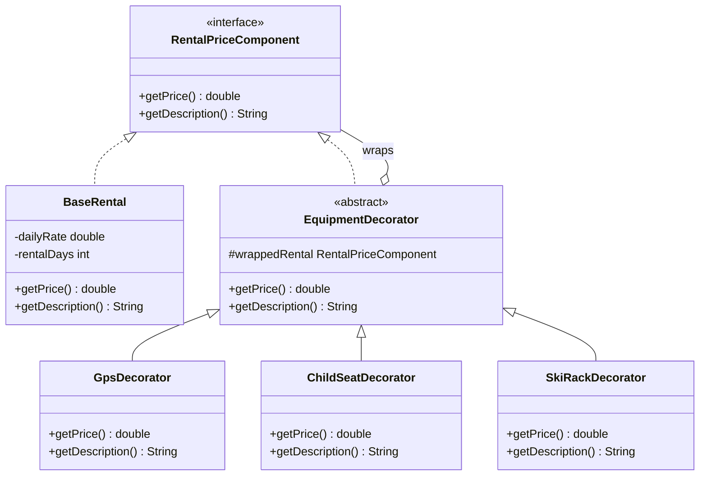
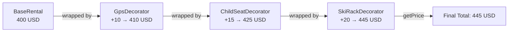
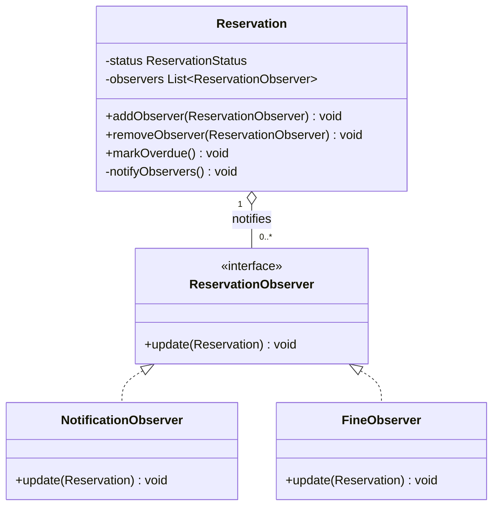
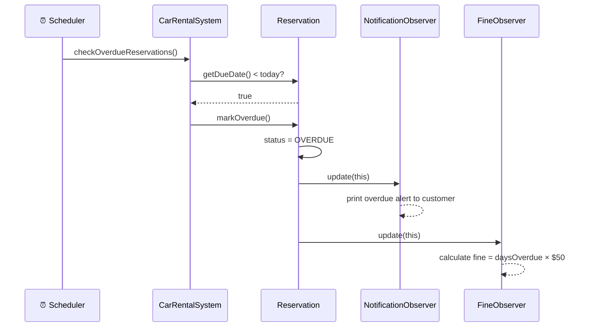
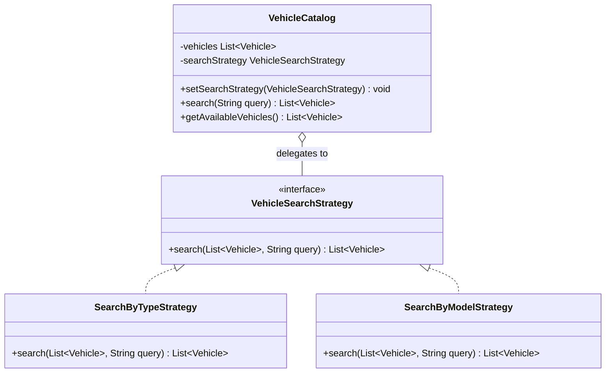
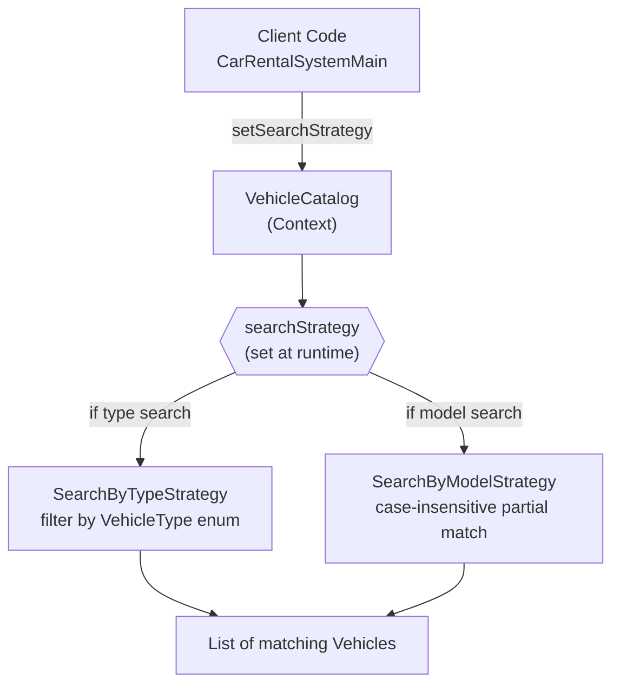

# Car Rental System

## Car Rental System Requirements

1. **User**: The system has two types of users: customers, who rent vehicles, and receptionists, who manage the rental process.
2. **Vehicle Types**: The system will include various vehicle types such as cars, trucks, vans and motorcycles for rental.
3. **Vehicle Subtypes**: Each vehicle type has subcategories:
    - Cars can be economy, luxury, standard, or compact.
    - Vans can be passenger or cargo.
    - Motorcycles can be sport, cruiser, or touring.
    - Trucks can be categorized as light, medium, or heavy-duty.
4. **Reservation Records**: The system will record who has rented each vehicle and the date it was issued.
5. **Rental Tracking**: The system will track how many vehicles a particular customer has rented.
6. **Reservation Cancellation**: Customer should be able to cancel their reservations.
7. **Vehicle Log**: To monitor all activities related to each vehicle, the system will keep a detailed log.
8. **Additional Equipment**: Users can add extra equipments to their reservations, such as ski racks, child seats and GPS navigation systems.
9. **Additional Services**: Users can search for vehicles by type or model within the system.
10. **Overdue Notifications and Fines**: If a vehicle isn't returned by the due date, the system will notify the customer and impose a fine.
11. **Vehicle Search**: Users can search for vehicles by type of model within the system.
12. **Branch Management**: The system will oversee the multiple branches of the car rental service.
13. **Parking Facilities**: Each branch will have parking stalls for the vehicles.

## Problem Understanding

Before writing a single line of code, the approach is to **read every requirement and ask: who does what, and what are the nouns?**

**Actors (who):**
- `Customer` — rents vehicles, can cancel reservations
- `Receptionist` — manages the rental process, adds vehicles to catalog
- `Driver` — a person with a license (optional actor, future use)

**Core Nouns (what):**
- `Vehicle` → subtypes: Car, Van, Truck, MotorCycle
- `Reservation` → links Customer ↔ Vehicle for a time period
- `CarRentalBranch` → has stalls and a catalog
- `ParkingStall` → physical space in a branch
- `VehicleCatalog` → searchable inventory of vehicles
- `VehicleLog` → audit trail of vehicle activity
- `Fine` / `Notification` → triggered when a rental goes overdue

---

## Identifying Entities & Actors

### Inheritance Hierarchy

```
Person (interface)
└── PersonAccessingAccount (abstract class)
    ├── Customer
    └── Receptionist

Vehicle (abstract class)
├── Car          → CarType    (ECONOMY, LUXURY, STANDARD, COMPACT)
├── Van          → VanType    (PASSENGER, CARGO)
├── Truck        → TruckType  (LIGHT, MEDIUM, HEAVY_DUTY)
└── MotorCycle   → MotorCycleType (SPORT, CRUISER, TOURING)
```

### Why `Vehicle` is an **abstract class**, not an interface

> An interface defines a **contract** (what something can do).
> An abstract class defines a **blueprint** (what something IS + shared state).

All vehicles share **state** — `vehicleId`, `brand`, `model`, `dailyRentalRate`, `status`, `parkingStall`, `vehicleLogs`.
Putting shared fields in an interface is impossible in Java. An abstract class is the right choice here.

The concrete subclasses (`Car`, `Van`, etc.) only add their **specific subtype enum** on top.

### Why `PersonAccessingAccount` is an **abstract class**, not an interface

All users (Customer, Receptionist) share the **same behavioural contract** — `login`, `logout`, `searchVehicle`, `updateProfile`.
An abstract class forces every subclass to implement those methods while also allowing shared fields (`name`, `age`) to live in subclasses naturally.

---

## Use Case Diagram

> Mermaid represents use cases using a flowchart — actors on the sides, system boundary in the middle, arrows showing which actor triggers which use case.



**Reading the diagram:**
- `Customer` is the primary actor — they drive most rental flows
- `Receptionist` manages inventory and confirms reservations on behalf of customers
- `Scheduler` (a background cron job) triggers the overdue fine process nightly — no human actor needed

---

## Class Diagram

> Full class diagram showing all entities, their relationships, and multiplicity.

```mermaid
classDiagram
    direction TB

    %% ── Interfaces ──────────────────────────────────────────
    class Person {
        <<interface>>
        +getName() String
        +getAge() int
    }

    class ReservationObserver {
        <<interface>>
        +update(Reservation) void
    }

    class VehicleSearchStrategy {
        <<interface>>
        +search(List~Vehicle~, String) List~Vehicle~
    }

    class RentalPriceComponent {
        <<interface>>
        +getPrice() double
        +getDescription() String
    }

    %% ── Abstract Classes ─────────────────────────────────────
    class PersonAccessingAccount {
        <<abstract>>
        +login(id, password) void
        +logout() void
        +bookVehicle() void
        +searchVehicle(VehicleCatalog) Vehicle
        +updateProfile(name, age) PersonAccessingAccount
    }

    class Vehicle {
        <<abstract>>
        -vehicleId String
        -brand String
        -model String
        -year int
        -dailyRentalRate double
        -status VehicleStatus
        -vehicleType VehicleType
        +addLog(VehicleLog) void
        +getStatus() VehicleStatus
        +setStatus(VehicleStatus) void
    }

    class EquipmentDecorator {
        <<abstract>>
        #wrappedRental RentalPriceComponent
        +getPrice() double
        +getDescription() String
    }

    %% ── People ───────────────────────────────────────────────
    class Customer {
        -customerId String
        -name String
        -age int
        -rentalHistory List~Reservation~
        +getRentalCount() int
        +addReservation(Reservation) void
        +cancelReservation(Reservation) void
    }

    class Receptionist {
        -receptionistId String
        -name String
        +processReservation(Reservation) void
        +addVehicleToCatalog(VehicleCatalog, Vehicle) void
    }

    class Driver {
        -licenseNumber String
    }

    %% ── Vehicles ─────────────────────────────────────────────
    class Car {
        -carType CarType
    }
    class Van {
        -vanType VanType
    }
    class Truck {
        -truckType TruckType
    }
    class MotorCycle {
        -motorCycleType MotorCycleType
    }

    %% ── Core Models ──────────────────────────────────────────
    class Reservation {
        -reservationId String
        -startDate LocalDate
        -dueDate LocalDate
        -returnDate LocalDate
        -status ReservationStatus
        -totalCost double
        +confirmReservation() void
        +startRental() void
        +cancelReservation() void
        +completeRental(LocalDate) void
        +markOverdue() void
        +addObserver(ReservationObserver) void
    }

    class VehicleCatalog {
        -vehicles List~Vehicle~
        -searchStrategy VehicleSearchStrategy
        +addVehicle(Vehicle) void
        +search(String) List~Vehicle~
        +getAvailableVehicles() List~Vehicle~
        +setSearchStrategy(VehicleSearchStrategy) void
    }

    class CarRentalBranch {
        -branchId String
        -branchName String
        -address String
        +addVehicleToCatalog(Vehicle) void
        +getAvailableStall() Optional~ParkingStall~
    }

    class ParkingStall {
        -stallId String
        -isOccupied boolean
        +parkVehicle(Vehicle) void
        +vacateStall() void
    }

    class VehicleLog {
        -logId String
        -vehicleId String
        -activityDescription String
        -activityDate LocalDateTime
        -performedBy String
    }

    class CarRentalSystem {
        -instance CarRentalSystem$
        -branches List~CarRentalBranch~
        -reservations Map~String, Reservation~
        -CarRentalSystem()
        +getInstance()$ CarRentalSystem
        +addBranch(CarRentalBranch) void
        +createReservation(Customer,Vehicle,LocalDate,LocalDate) Reservation
        +checkOverdueReservations() void
    }

    %% ── Decorators ───────────────────────────────────────────
    class BaseRental {
        -dailyRate double
        -rentalDays int
        +getPrice() double
        +getDescription() String
    }
    class GpsDecorator {
        +getPrice() double
        +getDescription() String
    }
    class ChildSeatDecorator {
        +getPrice() double
        +getDescription() String
    }
    class SkiRackDecorator {
        +getPrice() double
        +getDescription() String
    }

    %% ── Observers ────────────────────────────────────────────
    class NotificationObserver {
        +update(Reservation) void
    }
    class FineObserver {
        +update(Reservation) void
    }

    %% ── Search Strategies ────────────────────────────────────
    class SearchByTypeStrategy {
        +search(List~Vehicle~, String) List~Vehicle~
    }
    class SearchByModelStrategy {
        +search(List~Vehicle~, String) List~Vehicle~
    }

    %% ── Relationships ────────────────────────────────────────
    Person <|.. PersonAccessingAccount
    PersonAccessingAccount <|-- Customer
    PersonAccessingAccount <|-- Receptionist
    Person <|.. Driver

    Vehicle <|-- Car
    Vehicle <|-- Van
    Vehicle <|-- Truck
    Vehicle <|-- MotorCycle

    RentalPriceComponent <|.. BaseRental
    RentalPriceComponent <|.. EquipmentDecorator
    EquipmentDecorator <|-- GpsDecorator
    EquipmentDecorator <|-- ChildSeatDecorator
    EquipmentDecorator <|-- SkiRackDecorator
    EquipmentDecorator o-- RentalPriceComponent : wraps

    ReservationObserver <|.. NotificationObserver
    ReservationObserver <|.. FineObserver

    VehicleSearchStrategy <|.. SearchByTypeStrategy
    VehicleSearchStrategy <|.. SearchByModelStrategy

    Reservation --> Customer : for
    Reservation --> Vehicle : reserves
    Reservation o-- ReservationObserver : notifies

    Customer "1" --> "0..*" Reservation : rentalHistory
    Vehicle "1" --> "0..*" VehicleLog : logs

    CarRentalBranch "1" --> "1" VehicleCatalog : owns
    CarRentalBranch "1" --> "1..*" ParkingStall : has
    CarRentalBranch "1" --> "1..*" Receptionist : staffed by

    VehicleCatalog o-- VehicleSearchStrategy : uses
    VehicleCatalog "1" --> "0..*" Vehicle : holds

    CarRentalSystem "1" --> "1..*" CarRentalBranch : manages
    CarRentalSystem "1" --> "0..*" Reservation : tracks
```



---

## Design Patterns Used

---

### Singleton — `CarRentalSystem`

**Requirement:** The system manages multiple branches, all reservations, and all overdue checks from one place.

**Problem without Singleton:**
If multiple parts of the code created their own `CarRentalSystem` instances, each would have its own branch list and reservation map — leading to inconsistent state.

#### Singleton Structure



#### How it flows at runtime



**Solution:**

```java
public class CarRentalSystem {
    private static CarRentalSystem instance;
    private CarRentalSystem() { }  // private constructor — no one can do "new"

    public static CarRentalSystem getInstance() {
        if (instance == null) {
            instance = new CarRentalSystem();
        }
        return instance;
    }
}
```

**Interview talking point:**
> "I used Singleton because the rental system is a global coordinator — the single source of truth for all branches and reservations. In production, I'd make it thread-safe using double-checked locking or an enum-based Singleton."

---

### Decorator — Equipment Pricing

**Requirement 8:** Users can add extra equipment to their reservations — GPS, child seat, ski rack — each with its own cost.

**Problem without Decorator:**
You'd end up with combinatorial subclasses:
`RentalWithGps`, `RentalWithChildSeat`, `RentalWithGpsAndChildSeat`, `RentalWithAll`...
With just 3 add-ons this is 2³ = 8 classes. This explodes and violates OCP.

#### Decorator Class Structure



#### How wrapping stacks at runtime



**How it's used:**
```java
RentalPriceComponent price = new BaseRental(80.0, 5);   // $400
price = new GpsDecorator(price);                         // $410
price = new ChildSeatDecorator(price);                   // $425
price = new SkiRackDecorator(price);                     // $445

price.getPrice();        // → 445.0
price.getDescription();
// "Base rental (5 days @ $80.0/day) + GPS Navigation ($10.0) + Child Seat ($15.0) + Ski Rack ($20.0)"
```

**Interview talking point:**
> "Decorator lets me add equipment costs dynamically without touching `Reservation` or `Vehicle`. Each decorator wraps the previous one. This follows OCP — I can add a `BoosterSeatDecorator` tomorrow without modifying any existing class."

---

### Observer — Overdue Notifications & Fines

**Requirement 10:** If a vehicle isn't returned by the due date, notify the customer AND impose a fine.

**Problem without Observer:**
Hardcoding both notification and fine logic inside `Reservation.markOverdue()` couples the reservation to unrelated concerns. Every new reaction (e.g., send SMS, block future bookings) requires modifying `Reservation` — violating SRP and OCP.

#### Observer Class Structure



#### Overdue flow — Sequence Diagram



**Subject — `Reservation`:**
```java
public void markOverdue() {
    this.status = ReservationStatus.OVERDUE;
    notifyObservers();  // decoupled — reservation doesn't know what happens next
}
```

**Wired up in `CarRentalSystem.createReservation()`:**
```java
reservation.addObserver(new NotificationObserver());
reservation.addObserver(new FineObserver());
// Add more anytime: reservation.addObserver(new SmsObserver());
```

**Interview talking point:**
> "Observer decouples `Reservation` from the reactions to overdue. The reservation just says 'I'm overdue' — it doesn't care what the system does next. I can add `EmailObserver`, `BlockAccountObserver`, or `SMSObserver` without touching `Reservation`."

---

### Strategy — Vehicle Search

**Requirement 11:** Users can search for vehicles by type OR by model.

**Problem without Strategy:**
An `if-else` or `switch` inside `VehicleCatalog.search()` that branches on search mode. Every new search criterion (by brand, by year, by price range) means modifying `VehicleCatalog` — violating OCP.

#### Strategy Class Structure



#### Strategy swap at runtime



**`VehicleCatalog` — the Context:**
```java
public void setSearchStrategy(VehicleSearchStrategy strategy) {
    this.searchStrategy = strategy;  // swap at any time
}

public List<Vehicle> search(String query) {
    return searchStrategy.search(vehicles, query);  // delegate — no if-else here
}
```

**How it's used:**
```java
// Search by model name
catalog.setSearchStrategy(new SearchByModelStrategy());
catalog.search("civic");    // → [Honda Civic]

// Switch algorithm at runtime — zero changes inside catalog
catalog.setSearchStrategy(new SearchByTypeStrategy());
catalog.search("CAR");      // → [Tesla Model 3, Honda Civic]
```

**Interview talking point:**
> "Strategy lets me swap search algorithms at runtime. `VehicleCatalog` doesn't know how search works — it just delegates. Adding `SearchByBrandStrategy` tomorrow is a new class only, zero changes to existing code."

---

## SOLID Principles Applied

| Principle | Where Applied |
|---|---|
| **S — Single Responsibility** | `Reservation` only manages the rental lifecycle. `NotificationObserver` only sends alerts. `FineObserver` only calculates fines. `VehicleLog` only records activity. Each class has exactly one reason to change. |
| **O — Open/Closed** | `Vehicle` is open for extension (`Scooter extends Vehicle`) but closed for modification. Decorator classes add equipment without touching `Reservation`. New search strategies don't touch `VehicleCatalog`. |
| **L — Liskov Substitution** | Any `Vehicle` subclass (`Car`, `Van`, `Truck`) can replace a `Vehicle` reference transparently. Any `ReservationObserver` can be substituted without breaking `Reservation`. |
| **I — Interface Segregation** | `Person` is lean — just `getName()` and `getAge()`. `ReservationObserver` has only `update()`. `VehicleSearchStrategy` has only `search()`. No fat interfaces. |
| **D — Dependency Inversion** | `VehicleCatalog` depends on `VehicleSearchStrategy` (abstraction), not `SearchByTypeStrategy` (concretion). `Reservation` depends on `ReservationObserver` (abstraction), not concrete observers. `CarRentalSystem` depends on `CarRentalBranch` not specific branch implementations. |

---

## Key Design Decisions

### Decision 1: `Vehicle` as abstract class vs interface
The original code had `Vehicle` as an interface with `start()` and `stop()` — behavioural methods that don't belong in a rental domain model. In a rental system, a vehicle is a **data entity** (id, model, rate, status), not a driveable object. Changed to an abstract class holding all shared state.

### Decision 2: `Reservation` as the Observer Subject
Instead of making a separate `OverdueChecker` service own all the logic, the `Reservation` itself is the subject. It's the most natural owner of its own overdue state. The system-level `checkOverdueReservations()` is just a scanner that delegates to each reservation.

### Decision 3: `VehicleCatalog` owns the search strategy
The catalog is the keeper of vehicles — it's the correct Context for the Strategy pattern. This keeps the search concern colocated with the data being searched.

### Decision 4: `CarRentalBranch` owns a list of `ParkingStall`
The original had a single `ParkingStall` in the branch. Changed to `List<ParkingStall>` since a real branch has many stalls. The branch auto-parks each vehicle into an available stall when added to the catalog.

### Decision 5: Subtype enums on vehicle subclasses
Rather than a generic `String subType` on `Vehicle`, each subclass carries a strongly-typed enum (`CarType`, `VanType`, etc.). This makes the type system enforce valid values and enables exhaustive switch expressions.

---

## Requirement → Code Traceability

| Req # | Requirement | Code |
|---|---|---|
| 1 | Two user types: customers and receptionists | `Customer.java`, `Receptionist.java` extend `PersonAccessingAccount` |
| 2 | Vehicle types: cars, trucks, vans, motorcycles | `Car`, `Van`, `Truck`, `MotorCycle` in `models/vehicles/` |
| 3 | Vehicle subtypes (economy car, cargo van, etc.) | `CarType`, `VanType`, `TruckType`, `MotorCycleType` enums |
| 4 | Record who rented + date issued | `Reservation` stores `Customer`, `Vehicle`, `startDate`, `dueDate` |
| 5 | Track how many vehicles a customer has rented | `Customer.rentalHistory` (List) + `getRentalCount()` |
| 6 | Customer can cancel reservations | `Customer.cancelReservation(Reservation)` → `Reservation.cancelReservation()` |
| 7 | Vehicle log for all activities | `VehicleLog.java`, `Vehicle.addLog()`, logged on every `createReservation()` |
| 8 | Add extra equipment (GPS, child seat, ski rack) | **Decorator Pattern** — `GpsDecorator`, `ChildSeatDecorator`, `SkiRackDecorator` |
| 10 | Overdue notification + fine | **Observer Pattern** — `NotificationObserver`, `FineObserver` on `Reservation` |
| 11 | Search by type or model | **Strategy Pattern** — `SearchByTypeStrategy`, `SearchByModelStrategy` |
| 12 | Multiple branches | `CarRentalSystem` holds `List<CarRentalBranch>` |
| 13 | Parking stalls per branch | `CarRentalBranch` holds `List<ParkingStall>` |