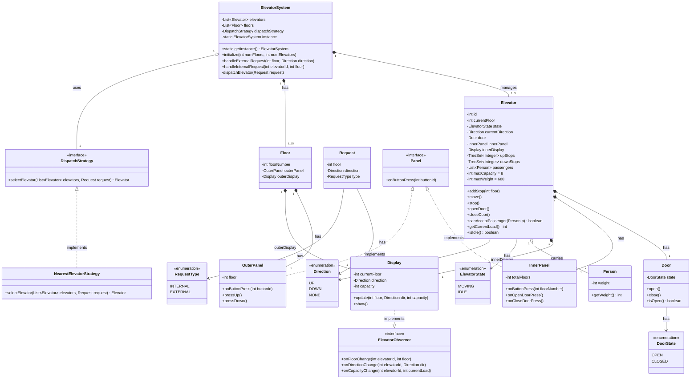
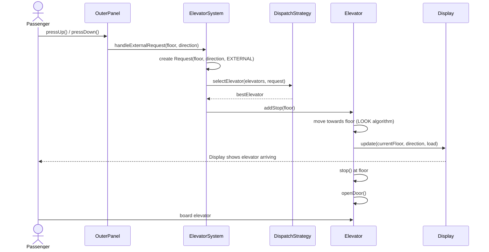
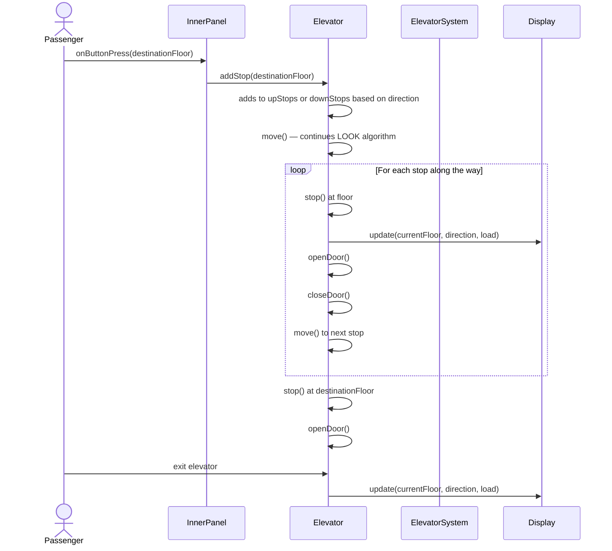

## Elevator System Requirements

1. **Elevators and Floors**: Thr building will have several elevator cars and multiple floors for them to service.
2. **Building Limits**: There's a cap of 15 floors in the building, with up to three elevators to service these floors.
3. **Elevator Movement**: Elevators can move up, move down, or stay idle (not moving).
4. **Elevator Door Operation**: The doors of an elevatir will only open when it's not moving, in its idle state.
5. **Floor Access**: Each elevator car will stop at every floor in the building.
6. **Outside Panel**: Outside each elevator, there will be a panel with buttons. These let you call an elevator and indicate if you want to go up or down.
7. **Inside Panel**: Inside each elevator, there will be a control panel with buttons for all floors and to open or close the elevator doors.
8. **Display**: Each elevator will have displays both inside and outside to show the current floor and the direction it is moving. The inside display will also show the elevator's capacity.
9. **Floor Panels and Displays**: Each floor will have its own set of panels and displays for calling elevators and showing their status.
10. **Passenger Directions**: Multiple passengers can use the elevator at the same time, even if they're going to different floors or in different directions.
11. **Elevator Control**: The elevator system manages the movement of the elevators, the operation of the doors, and keep an eye on elevator's statuses.
12. **Smart Dispatch**: When a passenger calls for an elevator, the system will choose the best elevator to send based on where the elevators are and where they are moving.
13. **Capacity**: Each elevator can hold up to eight people or a total weight of 680 kilograms at any one time.

---

## Clarifying Questions (before finalizing design)

Before diving into the design, here are some questions I'd want to get clarity on:

1. **Elevator Scheduling Algorithm**: When an elevator is moving **UP** and a passenger on an intermediate floor also wants to go **UP**, should the elevator stop to pick them up on the way? (i.e., should we follow a **SCAN/LOOK**-style algorithm where the elevator serves all requests in its current direction before reversing?)

2. **Overweight / Over-capacity Handling**: When the elevator reaches max capacity (8 people / 680 kg) and arrives at a floor where someone is waiting — should it **skip that floor** (and let the system dispatch another elevator), or should it still **stop to let people exit** first, and only skip boarding if still full?

3. **Idle Behavior**: When an elevator has no pending requests, should it **stay at its current floor** or **return to a default floor** (e.g., ground floor / lobby)?

4. **Emergency Scenarios**: Do we need to account for emergency situations (fire alarm, power outage, emergency stop button) in this design scope?

5. **Configurable Elevators**: The requirement says "up to three elevators" — should the number of elevators and floors be **configurable at initialization** time?

6. **Concurrent Direction Passengers**: Requirement 10 says passengers going in different directions can share the elevator. Does this mean the elevator should **not reject** someone going the opposite direction if there's capacity, or is it just stating that the system handles mixed destinations naturally?

> **Confirmed Answers:**
> 1. ✅ Yes — use **LOOK algorithm** (serve all same-direction requests before reversing).
> 2. ✅ Elevator always stops at a requested floor (to let people exit). It **allows new boarding only if capacity permits** (up to max capacity/weight).
> 3. ✅ Elevator **stays at its current floor** when idle.
> 4. ✅ Out of scope — not required.
> 5. ✅ Yes — configurable at initialization.
> 6. ✅ The elevator doesn't filter by direction — it naturally serves all queued floor stops. Mixed destinations are handled by the LOOK scheduling.

---

## Design Approach

### Design Patterns Used

#### 1. Singleton — `ElevatorSystem`

> **Requirement it addresses**: #11 — *"The elevator system manages the movement of the elevators, the operation of the doors, and keep an eye on elevator's statuses."*

**Why**: The entire building has exactly **one** central elevator control system. There should never be two competing controllers dispatching the same elevators — that would cause conflicts (e.g., two controllers sending different elevators to the same floor). Singleton guarantees a single point of coordination.

**How it's used**: `ElevatorSystem` uses a lazy-loaded inner static class holder (`ElevatorSystemHolder`). The client accesses it via `ElevatorSystem.getInstance()`. It owns all `Elevator` and `Floor` instances, and is the single entry point for both external requests (from `OuterPanel`) and internal requests (from `InnerPanel`).

---

#### 2. Strategy — `DispatchStrategy`

> **Requirement it addresses**: #12 — *"The system will choose the best elevator to send based on where the elevators are and where they are moving."*

**Why**: The dispatch algorithm is the **brain** of the system — and there's no single "correct" algorithm. Different buildings may want different behaviors:
- A short building might prefer **nearest idle elevator** (simple).
- A high-traffic building might prefer **SCAN-optimized dispatch** (efficient under load).
- A future requirement might call for **zone-based dispatch** (elevators assigned to floor ranges).

By extracting this into a `DispatchStrategy` interface, the algorithm becomes **swappable at runtime** without modifying `ElevatorSystem`. This follows the **Open/Closed Principle** — the system is open for extension (new strategies) but closed for modification.

**How it's used**: `ElevatorSystem` holds a `DispatchStrategy` reference. When `handleExternalRequest()` is called, it delegates to `dispatchStrategy.selectElevator(elevators, request)`. The current implementation is `NearestElevatorStrategy`, which scores elevators by: idle+closest → same-direction → fewest pending stops. A new strategy (e.g., `ZoneBasedStrategy`) can be plugged in via `setDispatchStrategy()` with zero changes to existing code.

---

#### 3. Observer — `ElevatorObserver` / `Display`

> **Requirement it addresses**: #8 — *"Each elevator will have displays both inside and outside to show the current floor and the direction it is moving. The inside display will also show the elevator's capacity."* and #9 — *"Each floor will have its own set of panels and displays."*

**Why**: Displays need to **react to elevator state changes** (floor, direction, capacity) in real time. Without Observer, the `Elevator` would need to know about every `Display` instance and manually call update methods on each — creating tight coupling. If a new display type is added (e.g., a lobby dashboard), `Elevator` would need modification.

With the Observer pattern, `Elevator` simply **notifies** all registered observers whenever its state changes. Displays subscribe and update themselves. The elevator doesn't know or care what's observing it.

**How it's used**: `ElevatorObserver` is an interface with three callbacks: `onFloorChange()`, `onDirectionChange()`, `onCapacityChange()`. `Display` implements this interface. Each `Elevator` maintains a `List<ElevatorObserver>` and calls `notifyObservers()` after every state change (movement, door open/close, passenger board/exit). The inner display is automatically registered in the `Elevator` constructor.

---

#### 4. Interface / Abstraction — `Panel`

> **Requirement it addresses**: #6 — *"Outside each elevator, there will be a panel with buttons"* and #7 — *"Inside each elevator, there will be a control panel with buttons for all floors and to open or close the elevator doors."*

**Why**: Both panels share the concept of "a user presses a button and something happens," but their behaviors are fundamentally different:
- **OuterPanel**: Has UP/DOWN buttons → triggers an external request to `ElevatorSystem` (dispatch an elevator).
- **InnerPanel**: Has floor buttons + open/close door → triggers an internal request on the `Elevator` itself.

A common `Panel` interface (`onButtonPress(int)`) allows polymorphic handling where needed, while each concrete class adds its own specialized methods (`pressUp()`/`pressDown()` on `OuterPanel`, `onOpenDoorPress()`/`onCloseDoorPress()` on `InnerPanel`). This follows **ISP** — the shared interface stays lean, and specialized behavior lives in the concrete classes.

### Key Design Decisions

1. **`ElevatorState` is split into `Direction` + `ElevatorState`** — The rough design had `MOVING` and `IDLE`. But "moving" doesn't tell us the direction. We use `ElevatorState { MOVING, IDLE }` and `Direction { UP, DOWN, NONE }` separately. This gives more flexibility.

2. **`Door` is its own class** — Decoupled from Elevator so door logic (safety checks, timing) is encapsulated independently.

3. **`Floor` class is introduced** — Each floor owns its `OuterPanel` and `Display`. This maps to requirement 9 cleanly.

4. **`Display` is NOT a singleton** — The rough design marked it singleton, but each elevator has an inner display and each floor has an outer display. Multiple instances are needed.

5. **Two stop queues per Elevator (`upStops`, `downStops`)** — This naturally supports the LOOK algorithm. When going UP, serve `upStops` in ascending order. When done, reverse and serve `downStops` in descending order.

6. **`Request` class to model all requests** — Encapsulates floor, direction, and type (INTERNAL vs EXTERNAL) in one place, keeping the system clean.

---

### Class Diagram



---

### Sequence Diagram — External Request (Passenger calls elevator from a floor)



### Sequence Diagram — Internal Request (Passenger selects destination floor)



---

### LOOK Algorithm — Elevator Movement Logic

```
┌─────────────────────────────────────────────────────────┐
│                  ELEVATOR MOVEMENT                       │
│                                                          │
│  State: IDLE                                             │
│    → On new request: set direction towards request       │
│    → Transition to MOVING                                │
│                                                          │
│  State: MOVING (Direction: UP)                           │
│    → Serve upStops in ascending order                    │
│    → At each stop: stop, open door, close door, move     │
│    → When upStops is empty:                              │
│        → If downStops not empty: reverse to DOWN         │
│        → Else: transition to IDLE                        │
│                                                          │
│  State: MOVING (Direction: DOWN)                         │
│    → Serve downStops in descending order                 │
│    → At each stop: stop, open door, close door, move     │
│    → When downStops is empty:                            │
│        → If upStops not empty: reverse to UP             │
│        → Else: transition to IDLE                        │
└─────────────────────────────────────────────────────────┘
```

---

### Dispatch Strategy — NearestElevatorStrategy Logic

The `selectElevator` method picks the best elevator using this priority:

1. **Idle elevator closest to the requested floor** — Least travel time.
2. **Moving elevator heading towards the floor in the same direction** — It can pick up the passenger on its way (e.g., elevator moving UP, is below the requested floor, and passenger wants to go UP).
3. **Any elevator** — Fallback; pick the one with the fewest pending stops.

---

### Package Structure (Proposed)

```
elevatorsystem/
├── ElevatorSystem.java              (Singleton — central controller)
├── models/
│   ├── Elevator.java                (Elevator car)
│   ├── Floor.java                   (Floor with panel + display)
│   ├── Door.java                    (Door with state)
│   ├── Person.java                  (Passenger with weight)
│   ├── Request.java                 (Encapsulates a request)
│   └── Display.java                 (Floor/direction/capacity display)
├── enums/
│   ├── ElevatorState.java           (MOVING, IDLE)
│   ├── Direction.java               (UP, DOWN, NONE)
│   ├── DoorState.java               (OPEN, CLOSED)
│   └── RequestType.java             (INTERNAL, EXTERNAL)
├── panels/
│   ├── Panel.java                   (Interface)
│   ├── InnerPanel.java              (Floor buttons + door controls)
│   └── OuterPanel.java              (Up/Down buttons)
├── observer/
│   └── ElevatorObserver.java        (Interface for display updates)
├── strategy/
│   ├── DispatchStrategy.java        (Interface)
│   └── NearestElevatorStrategy.java (Concrete implementation)
└── ElevatorSystemClient.java        (Demo / Driver class)
```

---

### Design Principles Applied

| Principle | How |
|-----------|-----|
| **SRP** | Each class has one responsibility — `Door` manages door state, `Display` manages rendering, `Elevator` manages movement |
| **OCP** | New dispatch strategies can be added without modifying `ElevatorSystem` (just implement `DispatchStrategy`) |
| **LSP** | `InnerPanel` and `OuterPanel` both honor the `Panel` contract |
| **ISP** | `Panel` interface is lean; `ElevatorObserver` only has relevant notification methods |
| **DIP** | `ElevatorSystem` depends on `DispatchStrategy` abstraction, not a concrete class |

