# Library Management System — Design Document

---

## Table of Contents
1. [Requirements](#1-requirements)
2. [High-Level Architecture](#2-high-level-architecture)
3. [Package Structure](#3-package-structure)
4. [Domain Model](#4-domain-model)
5. [Actor Hierarchy](#5-actor-hierarchy)
6. [Core Flows](#6-core-flows)
7. [Design Patterns Used](#7-design-patterns-used)
8. [SOLID Principles Applied](#8-solid-principles-applied)
9. [Key Design Decisions](#9-key-design-decisions)

---

## 1. Requirements

1. **Storage of Information:** The system must be able to keep records of all books and library members, as well as a detailed log of the book borrowing process.
2. **Book Identification:** Each book should have a unique ID, rack number, and other details to make finding it in library easy.
3. **Book Details:** Every book must have an ISBN, title, author, subject, and publication date associated with it.
4. **Book Copies:** There can be multiple copies of a book, each treated as an individual book item in the system.
5. **User Types:** The system recognizes two types of users:
   - Librarians: who manage the library
   - Members: who borrow books
6. **Library Cards:** Every user must have a library card with a unique number to use the library services.
7. **Borrowing Limit:** A member can borrow up to 10 books at any one time.
8. **Borrowing Duration:** Books can be borrowed for up to 15 days at a stretch.
9. **Book Reservation:** A book item can only be reserved by one member at a time.
10. **Issuance Record:** The system keeps the log of who borrowed or reserved a book and when.
11. **Renewals:** Member should be able to renew their borrowed books through the system.
12. **Overdue Notification:** The system will alert users if the book is not returned by its due date.
13. **Reservation for Unavailable Books:** If a book is currently checked out, member should be able to reserve it for when it returns.
14. **Book Search:** Users should be able to search for books by title, author, subject, or publication date.

---

## 2. High-Level Architecture

The system follows a **layered architecture** with clear separation between actors, service orchestration, domain models, and infrastructure records.

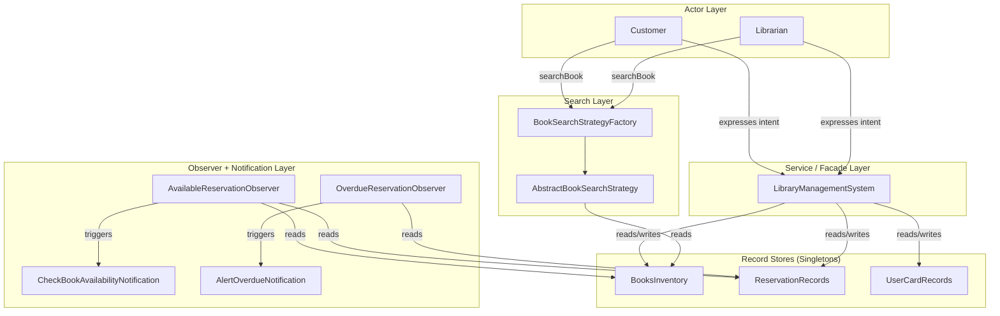

**Key architectural principle:** Actors never reach into record stores directly. All state mutations flow through `LibraryManagementSystem`. Actors only express intent — the system fulfils it.

---

## 3. Package Structure

```
library_management_system/
│
├── LibraryManagementSystem.java       ← Facade / Service orchestrator
├── LibraryManagementSystemClient.java ← Driver / Entry point
│
├── actors/          ← Who uses the system
│   ├── User.java                  (interface)
│   ├── Member.java                (interface, extends User)
│   ├── Admin.java                 (interface, extends User)
│   ├── AbstractUser.java          (abstract class, shared search logic)
│   ├── Customer.java              (extends AbstractUser, implements Member)
│   └── Librarian.java             (extends AbstractUser, implements Admin)
│
├── models/          ← Domain objects (pure data)
│   ├── Book.java
│   ├── BookCopy.java
│   ├── BookCopyStatus.java        (enum: AVAILABLE, ISSUED)
│   ├── BookReservation.java
│   ├── BookReservationStatus.java (enum: BORROWED, QUEUED, OVERDUE)
│   ├── LibraryCard.java
│   └── MembershipType.java        (enum: MONTHLY, ANNUAL, LIFETIME)
│
├── records/         ← Singleton data stores
│   ├── BooksInventory.java
│   ├── ReservationRecords.java
│   └── UserCardRecords.java
│
├── search/          ← Strategy pattern for book search
│   ├── BookSearchStrategy.java            (interface)
│   ├── AbstractBookSearchStrategy.java    (abstract class, fetches books internally)
│   ├── BookSearchStrategyFactory.java     (factory)
│   ├── BookTitleSearchStrategy.java
│   ├── BookAuthorSearchStrategy.java
│   ├── BookSubjectSearchStrategy.java
│   └── BookPublicationDateSearchStrategy.java
│
├── observer/        ← Detect events, trigger notifications
│   ├── ReservationObserver.java           (interface)
│   ├── AvailableReservationObserver.java  (book returned → check queue)
│   └── OverdueReservationObserver.java    (borrowed past due date)
│
├── notification/    ← Pure notification (no state mutation)
│   ├── ReservationNotification.java       (interface)
│   ├── CheckBookAvailabilityNotification.java
│   └── AlertOverdueNotification.java
│
└── utils/
    └── BookSearchCriteria.java            (Builder pattern)
```

---

## 4. Domain Model

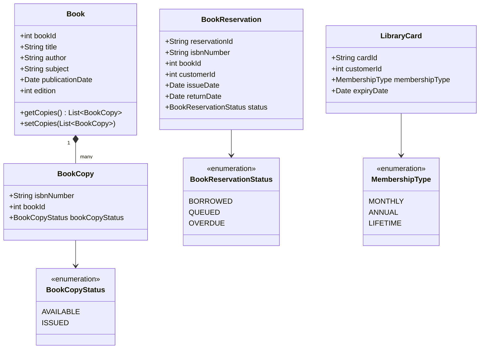

**Key model decisions:**
- `Book` represents the logical title. `BookCopy` represents a physical copy with a unique ISBN.
- A `BookReservation` is the log record for every borrow or queue event. It links a `customerId` to a `bookId` and optionally an `isbnNumber` (null when QUEUED — no copy was assigned yet).
- `BookReservationStatus` drives the borrow lifecycle: `BORROWED` → `OVERDUE` (if past due date) or removed (if returned). `QUEUED` → notified when a copy becomes `AVAILABLE`.

---

## 5. Actor Hierarchy

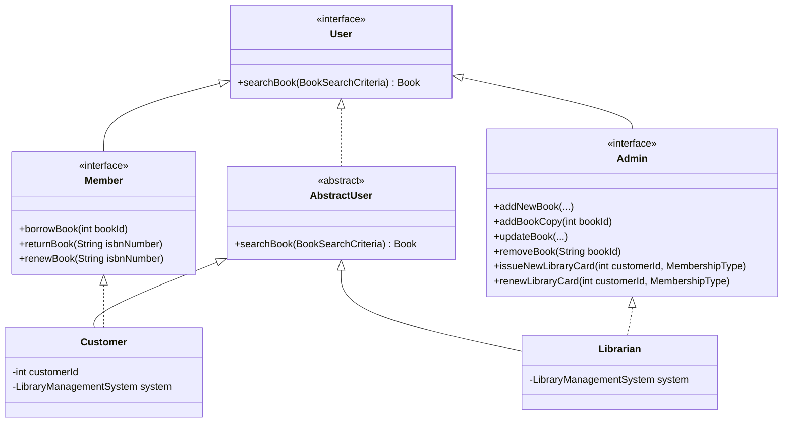

**Design rationale:**
- `User` is the common contract for all actors — exposes only `searchBook`.
- `Member` extends `User` with borrow-side intents. `Admin` extends `User` with management intents. This is **Interface Segregation** — actors only know about the methods relevant to their role.
- `AbstractUser` holds the shared `searchBook` implementation once (delegates to `BookSearchStrategyFactory`). Both `Customer` and `Librarian` inherit it — no duplication.
- Both `Customer` and `Librarian` hold a reference to `LibraryManagementSystem` (injected via constructor). Every method is a thin delegator — the actor expresses intent, the system fulfils it.

---

## 6. Full System Class Diagram

This diagram shows the complete class structure and all relationships across every package.

```mermaid
classDiagram

    %% ── Actors ──────────────────────────────────────────
    class User {
        <<interface>>
        +searchBook(BookSearchCriteria) Book
    }
    class Member {
        <<interface>>
        +borrowBook(int bookId)
        +returnBook(String isbnNumber)
        +renewBook(String isbnNumber)
    }
    class Admin {
        <<interface>>
        +addNewBook(String, String, String, Date, int)
        +addBookCopy(int bookId)
        +updateBook(int, String, String, String, Date, int)
        +removeBook(String bookId)
        +issueNewLibraryCard(int, MembershipType)
        +renewLibraryCard(int, MembershipType)
    }
    class AbstractUser {
        <<abstract>>
        +searchBook(BookSearchCriteria) Book
    }
    class Customer {
        -int customerId
        -LibraryManagementSystem system
        +borrowBook(int bookId)
        +returnBook(String isbnNumber)
        +renewBook(String isbnNumber)
        +getCustomerId() int
    }
    class Librarian {
        -LibraryManagementSystem system
        +addNewBook(String, String, String, Date, int)
        +addBookCopy(int bookId)
        +updateBook(int, String, String, String, Date, int)
        +removeBook(String bookId)
        +issueNewLibraryCard(int, MembershipType)
        +renewLibraryCard(int, MembershipType)
    }

    User <|-- Member
    User <|-- Admin
    User <|.. AbstractUser
    AbstractUser <|-- Customer
    AbstractUser <|-- Librarian
    Member <|.. Customer
    Admin <|.. Librarian

    %% ── Service / Facade ────────────────────────────────
    class LibraryManagementSystem {
        -BooksInventory booksInventory
        -ReservationRecords reservationRecords
        -UserCardRecords userCardRecords
        +handleBookBorrow(int, int)
        +handleBookReturn(int, String)
        +handleBookRenewal(int, String)
        +handleIssueNewLibraryCard(int, MembershipType)
        +handleRenewLibraryCard(int, MembershipType)
        +handleAddNewBook(String, String, String, Date, int)
        +handleAddBookCopy(int)
        +handleUpdateBook(int, String, String, String, Date, int)
        +handleRemoveBook(String)
    }

    Customer --> LibraryManagementSystem : delegates to
    Librarian --> LibraryManagementSystem : delegates to

    %% ── Models ──────────────────────────────────────────
    class Book {
        -int bookId
        -String title
        -String author
        -String subject
        -Date publicationDate
        -int edition
        -List~BookCopy~ copies
        +getCopies() List~BookCopy~
        +setCopies(List~BookCopy~)
    }
    class BookCopy {
        -String isbnNumber
        -int bookId
        -BookCopyStatus bookCopyStatus
        +getBookCopyStatus() BookCopyStatus
        +setBookCopyStatus(BookCopyStatus)
    }
    class BookCopyStatus {
        <<enumeration>>
        AVAILABLE
        ISSUED
    }
    class BookReservation {
        -String reservationId
        -String isbnNumber
        -int bookId
        -int customerId
        -Date issueDate
        -Date returnDate
        -BookReservationStatus status
        +getBookReservationStatus() BookReservationStatus
        +setBookReservationStatus(BookReservationStatus)
    }
    class BookReservationStatus {
        <<enumeration>>
        BORROWED
        QUEUED
        OVERDUE
    }
    class LibraryCard {
        -String cardId
        -int customerId
        -MembershipType membershipType
        -Date expiryDate
    }
    class MembershipType {
        <<enumeration>>
        MONTHLY
        ANNUAL
        LIFETIME
    }

    Book "1" *-- "many" BookCopy
    BookCopy --> BookCopyStatus
    BookReservation --> BookReservationStatus
    LibraryCard --> MembershipType

    %% ── Record Stores ────────────────────────────────────
    class BooksInventory {
        -List~Book~ books
        +getInstance() BooksInventory$
        +getBooks() List~Book~
        +getBookById(int) Book
        +getBookCopyByBookId(int) BookCopy
        +addBook(String, String, String, Date, int)
        +addBookCopy(int)
        +updateBook(int, String, String, String, Date, int)
        +removeBook(String)
    }
    class ReservationRecords {
        -List~BookReservation~ records
        +getInstance() ReservationRecords$
        +getBookReservationRecords() List~BookReservation~
        +getOverdueReservations() List~BookReservation~
        +getQueuedReservations() List~BookReservation~
        +addReservationRecord(BookReservation)
        +removeReservationRecord(BookReservation)
    }
    class UserCardRecords {
        -List~LibraryCard~ libraryCards
        +getInstance() UserCardRecords$
        +getLibraryCardsHolders() List~LibraryCard~
        +addLibraryCardHolder(LibraryCard)
    }

    BooksInventory "1" o-- "many" Book
    ReservationRecords "1" o-- "many" BookReservation
    UserCardRecords "1" o-- "many" LibraryCard

    LibraryManagementSystem --> BooksInventory : reads/writes
    LibraryManagementSystem --> ReservationRecords : reads/writes
    LibraryManagementSystem --> UserCardRecords : reads/writes

    %% ── Search ───────────────────────────────────────────
    class BookSearchStrategy {
        <<interface>>
        +getBook(BookSearchCriteria) Book
    }
    class AbstractBookSearchStrategy {
        <<abstract>>
        -BooksInventory booksInventory
        #getBooks() List~Book~
    }
    class BookTitleSearchStrategy {
        +getBook(BookSearchCriteria) Book
    }
    class BookAuthorSearchStrategy {
        +getBook(BookSearchCriteria) Book
    }
    class BookSubjectSearchStrategy {
        +getBook(BookSearchCriteria) Book
    }
    class BookPublicationDateSearchStrategy {
        +getBook(BookSearchCriteria) Book
    }
    class BookSearchStrategyFactory {
        +getSearchStrategy(BookSearchCriteria)$ BookSearchStrategy
    }
    class BookSearchCriteria {
        -String title
        -String author
        -String subject
        -Date publicationDate
        +builder()$ Builder
        +getTitle() String
        +getAuthor() String
        +getSubject() String
        +getPublicationDate() Date
    }

    BookSearchStrategy <|.. AbstractBookSearchStrategy
    AbstractBookSearchStrategy <|-- BookTitleSearchStrategy
    AbstractBookSearchStrategy <|-- BookAuthorSearchStrategy
    AbstractBookSearchStrategy <|-- BookSubjectSearchStrategy
    AbstractBookSearchStrategy <|-- BookPublicationDateSearchStrategy
    BookSearchStrategyFactory ..> BookSearchStrategy : creates
    AbstractBookSearchStrategy --> BooksInventory : reads
    AbstractUser --> BookSearchStrategyFactory : uses

    %% ── Observer + Notification ──────────────────────────
    class ReservationObserver {
        <<interface>>
        +observe()
    }
    class ReservationNotification {
        <<interface>>
        +notifyUser(List~BookReservation~)
    }
    class AvailableReservationObserver {
        -ReservationNotification notificationService
        -ReservationRecords reservationRecords
        -BooksInventory booksInventory
        +observe()
    }
    class OverdueReservationObserver {
        -ReservationNotification notificationService
        -ReservationRecords reservationRecords
        +observe()
    }
    class CheckBookAvailabilityNotification {
        +notifyUser(List~BookReservation~)
    }
    class AlertOverdueNotification {
        +notifyUser(List~BookReservation~)
    }

    ReservationObserver <|.. AvailableReservationObserver
    ReservationObserver <|.. OverdueReservationObserver
    ReservationNotification <|.. CheckBookAvailabilityNotification
    ReservationNotification <|.. AlertOverdueNotification
    AvailableReservationObserver --> ReservationNotification : triggers
    OverdueReservationObserver --> ReservationNotification : triggers
    AvailableReservationObserver --> ReservationRecords : reads
    AvailableReservationObserver --> BooksInventory : reads
    OverdueReservationObserver --> ReservationRecords : reads
```

---

## 7. Use Case Diagrams

### 7.1 Member Use Cases

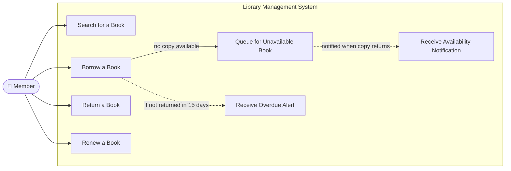

### 7.2 Librarian Use Cases

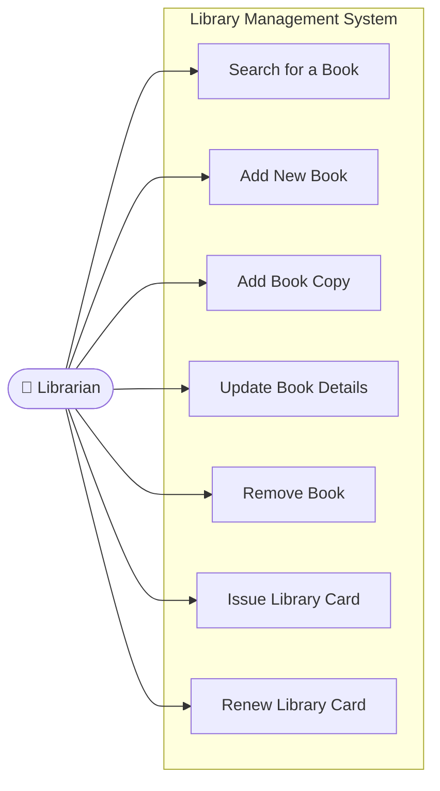

### 7.3 System-Triggered Use Cases

These are not initiated by a user action — they are triggered by the system based on state changes or a schedule.

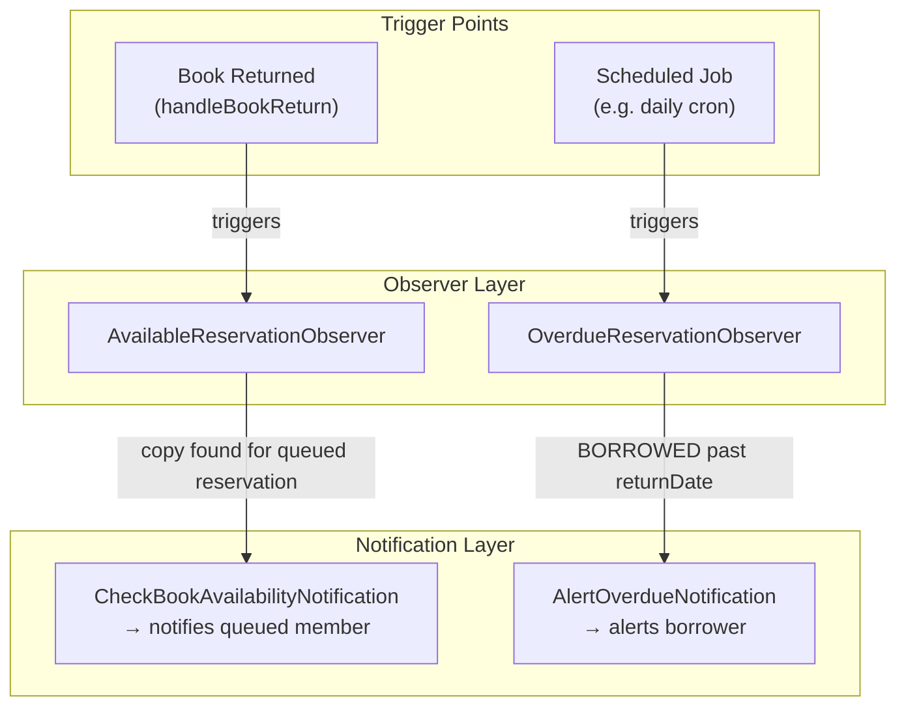

---

### 6.1 Borrow Flow

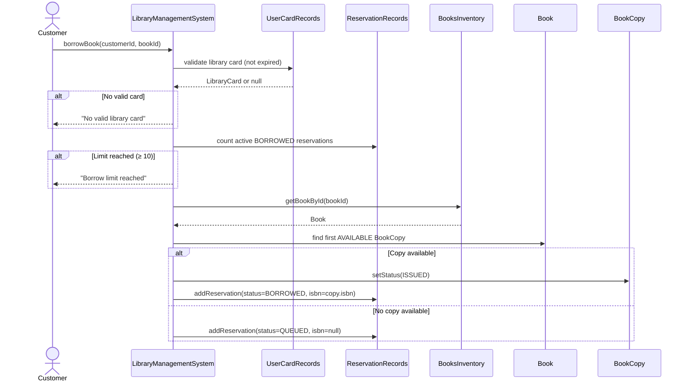

### 6.2 Return Flow

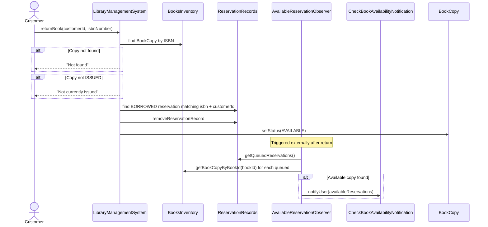

### 6.3 Overdue Check Flow

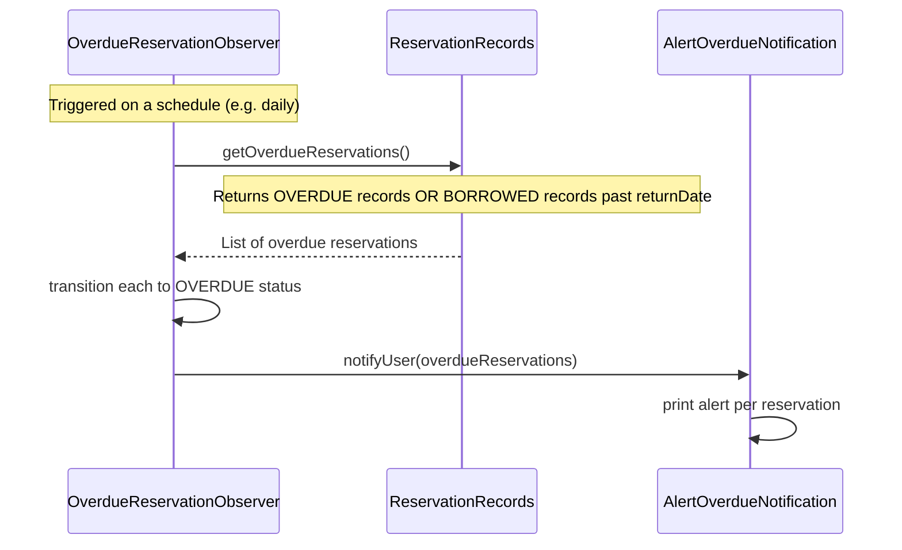

### 6.4 Search Flow

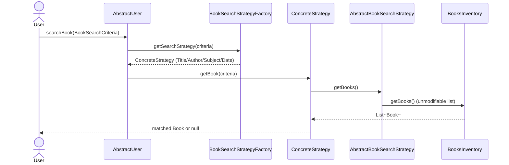

---

## 7. Design Patterns Used

### 7.1 Singleton — Record Stores
`BooksInventory`, `ReservationRecords`, and `UserCardRecords` are implemented using the **Bill Pugh Singleton** (static inner holder class). This gives:
- **Lazy initialisation** — the instance is only created when first accessed
- **Thread safety** — guaranteed by the JVM class loading mechanism
- **No synchronization overhead** — no `synchronized` keyword needed

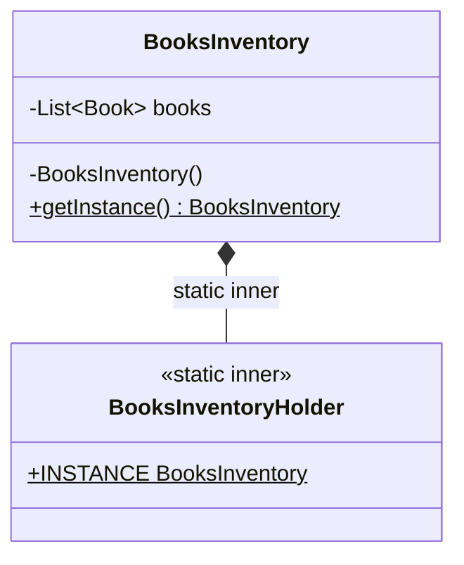

The same pattern is applied identically to `ReservationRecords` and `UserCardRecords`.

---

### 7.2 Strategy — Book Search
The search mechanism uses the **Strategy pattern** to select the correct search algorithm at runtime based on which field of `BookSearchCriteria` is populated.

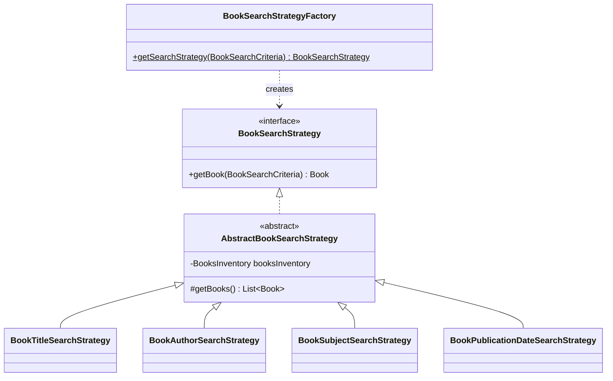

`AbstractBookSearchStrategy` acts as a **Template** base — it holds the `BooksInventory` singleton and exposes `getBooks()` to all concrete strategies. This means callers never need to pass a book list — the strategy fetches it internally.

`BookSearchStrategyFactory` inspects the `BookSearchCriteria` object and returns the appropriate strategy. Adding a new search dimension (e.g. by ISBN) only requires adding a new strategy class and a factory branch — existing code is untouched (**Open/Closed Principle**).

---

### 7.3 Builder — BookSearchCriteria
`BookSearchCriteria` uses the **Builder pattern** (static nested Builder class) to construct a criteria object without telescoping constructors. Since only one search field is typically set at a time, the builder makes valid states explicit and invalid states (no fields set) catchable at the factory level.

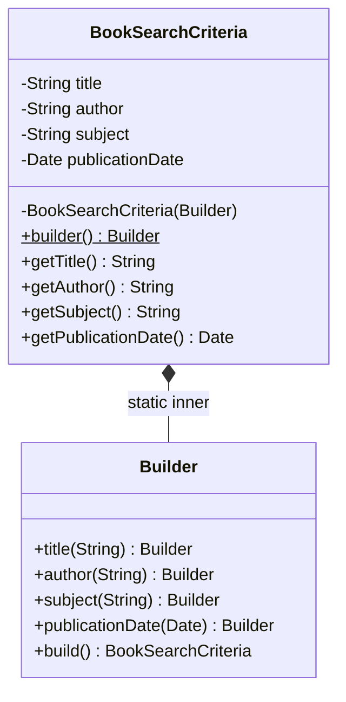

---

### 7.4 Observer + Notification (Two-Layer)
The event-driven behaviour is split into two distinct layers:

**Observer layer** — detects conditions and decides whether to fire:
- `AvailableReservationObserver` — scans queued reservations after a return, checks if a copy is now available
- `OverdueReservationObserver` — scans borrowed reservations, finds ones past their return date, transitions them to `OVERDUE`

**Notification layer** — pure output, zero state mutation:
- `CheckBookAvailabilityNotification` — notifies queued customers a copy is available
- `AlertOverdueNotification` — alerts users about overdue books

Each observer holds an injected `ReservationNotification` (constructor injection). This decouples the detection logic from the delivery mechanism entirely — you can swap `System.out.println` for an email service without touching the observers.

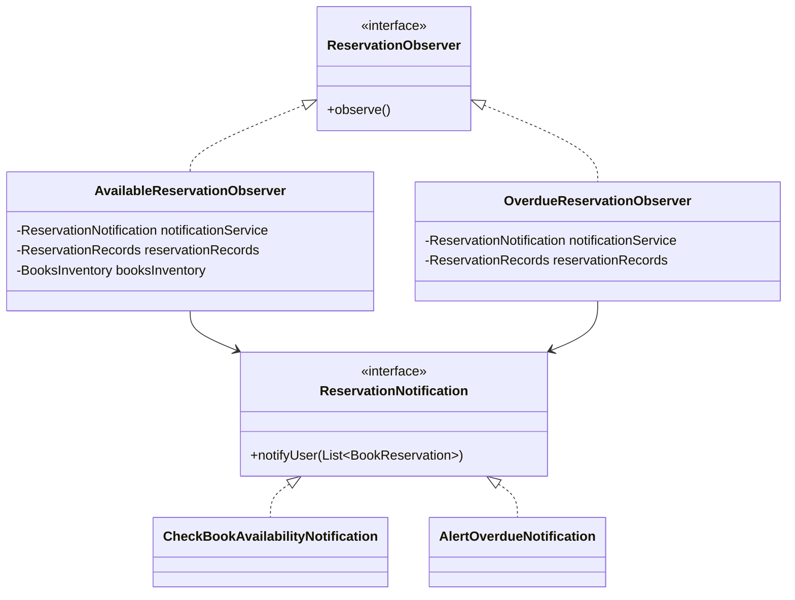

---

### 7.5 Facade — LibraryManagementSystem
`LibraryManagementSystem` acts as a **Facade** over the three record stores. All state mutations in the system flow through it. Actors (`Customer`, `Librarian`) never access `BooksInventory`, `ReservationRecords`, or `UserCardRecords` directly.

This gives a single entry point for all business logic — validation (card check, borrow limit), state transitions (BORROWED → AVAILABLE on return), and coordination across multiple record stores all live here.

---

## 8. SOLID Principles Applied

| Principle | How it is applied |
|---|---|
| **Single Responsibility (SRP)** | Each class has one job. `BooksInventory` stores books. `ReservationRecords` stores reservations. `LibraryManagementSystem` orchestrates. Notifications only notify. Observers only detect. |
| **Open/Closed (OCP)** | Adding a new search type (e.g. by ISBN) requires only a new `BookSearchStrategy` subclass and one factory branch. No existing class is modified. |
| **Liskov Substitution (LSP)** | `Customer` and `Librarian` both extend `AbstractUser` — `searchBook` behaves identically through the base type. Any concrete `BookSearchStrategy` can be substituted for another transparently. |
| **Interface Segregation (ISP)** | `User`, `Member`, and `Admin` are separate interfaces. `Customer` only sees member-relevant methods. `Librarian` only sees admin-relevant methods. Neither is forced to implement methods from the other role. |
| **Dependency Inversion (DIP)** | `Customer` and `Librarian` depend on the `LibraryManagementSystem` abstraction injected at construction — not on concrete record stores. Observers depend on the `ReservationNotification` interface — not on concrete notification classes. |

---

## 9. Key Design Decisions

### Actors express intent, system fulfils it
`Customer.borrowBook(bookId)` is a thin delegator — it passes `customerId` and `bookId` to `LibraryManagementSystem`. The actor carries only its identity; all orchestration logic lives in the service layer. This keeps actors lightweight and the system testable.

### Primitives over objects in service contracts
`handleBookBorrow(int customerId, int bookId)` takes primitive IDs rather than full `Customer` and `Book` objects. This avoids stale object reference bugs — the system always fetches the latest state from the record store using the ID.

### Unmodifiable list as the public API for `Book.getCopies()`
`getCopies()` returns `Collections.unmodifiableList(copies)` — external callers get a safe read-only view. Mutation of the copies list happens only through controlled paths inside `BooksInventory`.

### QUEUED reservations store bookId, not isbnNumber
When no copy is available at borrow time, the reservation is created with a null `isbnNumber`. The queue is keyed on `bookId`. When a copy is returned, `AvailableReservationObserver` looks up available copies by `bookId` — this is the correct semantic since no specific ISBN was promised to the queued customer.

### Two-phase Observer: state transition then notification
State transitions (BORROWED → OVERDUE) happen in the observer before calling the notification service. The notification layer receives already-correct data and only outputs — zero mutation inside a notification method. This respects Command-Query Separation within the notification boundary.

### Bill Pugh Singleton over double-checked locking
All three record stores use the static inner holder class pattern instead of `synchronized getInstance()` or volatile double-checked locking. It achieves the same thread-safety guarantee with no runtime overhead — the JVM's class loading mechanism ensures single initialisation.
